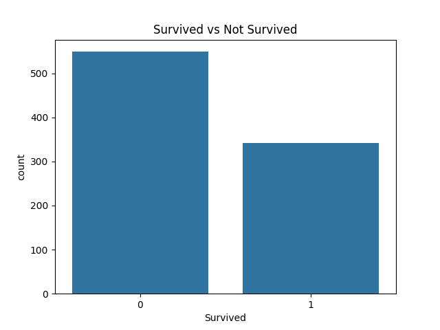
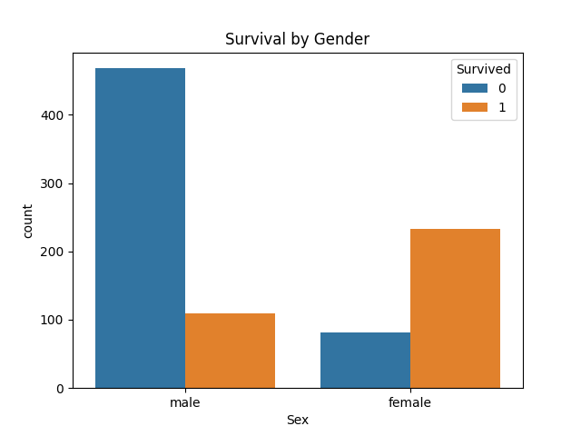
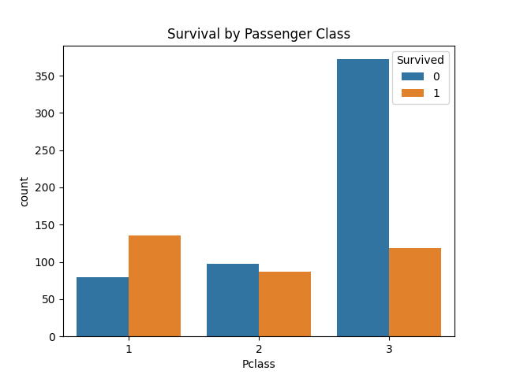

# 🚢 Titanic Survival Prediction

A machine learning project that predicts whether a Titanic passenger survived or not, based on features like age, gender, and passenger class — using Logistic Regression.


---

## 📌 Project Overview

The Titanic disaster is one of the most well-known shipwrecks in history. This project uses passenger data (age, sex, ticket class, etc.) to build a machine learning model that predicts survival outcomes.

---

## 📊 Model Performance

| Metric | Score |
|--------|-------|
| Accuracy | 79.89% |
| Precision (class 0) | 0.82 |
| Precision (class 1) | 0.77 |
| F1-Score (weighted) | 0.80 |

---

## 🔍 Key Findings from EDA

- **Gender:** Female passengers had a significantly higher survival rate due to the "women and children first" policy
- **Passenger Class:** 1st class passengers survived more than 3rd class passengers
- **Most Important Features:** `Sex` and `Pclass` are the strongest predictors of survival

## 📈 Visualizations





---

## 📁 Project Structure

```
titanic-survival-prediction/
│
├── data/
│   └── train.csv               # Titanic dataset
│
├── notebooks/
│   └── 01_EDA.ipynb            # Exploratory Data Analysis
│
├── src/
│   └── model.py                # Data preprocessing + model training
│
├── models/
│   └── titanic_model.pkl       # Saved trained model
│
├── reports/                    # Graphs and visualizations
│
├── requirements.txt            # Project dependencies
└── README.md
```

---

## 🔧 Technologies Used

- **Language:** Python 3.14
- **Data Processing:** Pandas, NumPy
- **Machine Learning:** Scikit-learn (Logistic Regression)
- **Visualization:** Matplotlib, Seaborn
- **Model Saving:** Joblib

---

## 🚀 How to Run

**1. Clone the repository**
```bash
git clone https://github.com/rahat-ai-dev/titanic-survival-prediction.git
cd titanic-survival-prediction
```

**2. Install dependencies**
```bash
pip install -r requirements.txt
```

**3. Run the model**
```bash
python src/model.py
```

---

## 📦 Dataset

- **Source:** [Kaggle Titanic Competition](https://www.kaggle.com/competitions/titanic)
- **Training samples:** 891 passengers
- **Features:** Pclass, Sex, Age, SibSp, Parch, Fare, Embarked

---

## 👤 Author

**Rahat**
- GitHub: [@rahat-ai-dev](https://github.com/rahat-ai-dev)